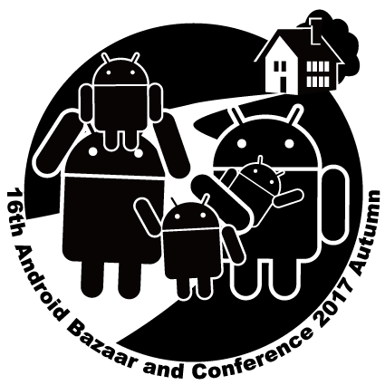

### こんなカンファレンス行きました
　　　　　　　　　　　　　〜2017/10〜
 

 
 
　　　　　　　　　　　　Naoki Takimoto
---
今回行ったカンファレンス
 

* DevFest Tokyo 2017
* Android Bazaar and Conference 2017 Autumn （ABC 2017 Autumn）

---
### DevFest Tokyo 2017

---
DevFest Tokyo 2017
 

日時：2017/10/9(月) 10:00〜17:00 
場所：東京国際交流館 
主催：[東京で活躍している 14 のコミュニティ](https://tokyo.gdgjapan.org/team) 
人数：約1,000人 
内容：[タイムテーブル](https://tokyo.gdgjapan.org/schedule/day1) 
URL：https://tokyo.gdgjapan.org/ 

---
個人スケジュール
 

10:00　オープニング

10:40　クラウドってなんだろ？クラウドを活かすアプリケーション設計とは？

11:30　大半のウェブサービス/アプリは，Firebaseなら簡単で安いですよ

12:10　昼休憩

13:20　ナビゲーションのUIベストプラクティス

14:10　React Nativeアプリをリリースし続けるために、最初に行う8つの取り組み

15:00　FirebaseAnalytics + BigQuery + DataStudio

15:50　FlutterでAndroid/iOS両対応のアプリ開発

---
### Android Bazaar and  Conference 2017 Autumn

---
Android Bazaar and Conference 2017 Autumn
 

日時：2017/10/14(土) 10:00〜18:00 
場所：川崎市産業振興会館 
主催：日本Androidの会 
人数：約500人 
内容：[タイムテーブル](http://abc.android-group.jp/2017a/timetables/) 
　　　[バザール](http://abc.android-group.jp/2017a/bazaar/) 
URL：http://abc.android-group.jp/2017a/ 

---
個人スケジュール
 

10:00　オープニング

10:10　はじめてのボイス・アシスタント ---Amazon Echo/Alexa と Google Assistant---

11:10　Android登場10年目～Androidのイマを魅る～

12:00　昼休憩

13:00　Google AR101（TangoからARCore、WebAR）

14:00　はじめてのActions on Google

15:00　はじめてのMonaca ～中学校でもできる本格スマホアプリ開発

16:00　アプリカンではじめるハイブリッドアプリ開発

17:15　恒例☆秋の大LT大会

