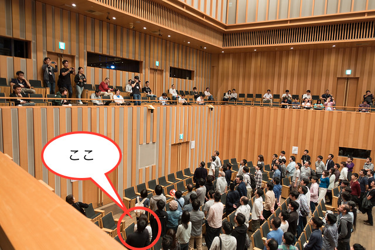

### こんなカンファレンス行きました
　　　　　　　　　　　　　〜2017/10〜
 

 
 
　　　　　　　　　　　　Naoki Takimoto
---
今回行ったカンファレンス
 

* DevFest Tokyo 2017
* Android Bazaar and Conference 2017 Autumn （ABC 2017 Autumn）

---
### DevFest Tokyo 2017

---
DevFest Tokyo 2017
 

日時：2017/10/9(月) 10:00〜17:00 
場所：東京国際交流館 
主催：[東京で活躍している 14 のコミュニティ](https://tokyo.gdgjapan.org/team) 
人数：約1,000人 
内容：[タイムテーブル](https://tokyo.gdgjapan.org/schedule/day1) 
URL：https://tokyo.gdgjapan.org/ 

---
### レポート

---
個人スケジュール
 

10:00　オープニング

10:40　クラウドってなんだろ？クラウドを活かすアプリケーション設計とは？

11:30　大半のウェブサービス/アプリは、Firebaseなら簡単で安いですよ

12:10　昼休憩

13:20　ナビゲーションのUIベストプラクティス

14:10　React Nativeアプリをリリースし続けるために、最初に行う8つの取り組み

15:00　FirebaseAnalytics + BigQuery + DataStudio

15:50　FlutterでAndroid/iOS両対応のアプリ開発

---
オープニング
 

---
オープニング
 

---
クラウドってなんだろ？クラウドを活かすアプリケーション設計とは？
 [@sinmetal](https://qiita.com/sinmetal)
 

* クラウドのメリット
  * H/Wのイニシャルコストが不要
  * H/Wのリプレースも不要
  * H/Wの構成を容易に変更可能
* クラウドでもH/Wがデータセンターに存在し、日々壊れている
  * H/Wが壊れたとしても、すぐ別のH/Wが生成され蘇る
  * クラウドが壊れることを前提に設計を行う必要あり

---
クラウドってなんだろ？クラウドを活かすアプリケーション設計とは？
 

* クラウドを活かすには？
  * 可用性(Availability)をあげる
    * リトライ
    * リクリエイト
  * パフォーマンスを上げる
    * 非同期処理(Queue)
    * 分散処理
* [発表資料](https://goo.gl/X54o2S)

Note:
リトライ
* 様々なレイヤー
  * クライアント・アプリケーションサーバ間
　* アプリケーションサーバ・DBサーバ間
* 適切なタイムアウト設定
* リトライを何回しても、複数のデータが作成されないようにする(冪等性(べきとう))

リクリエイト
* 複数インスタンスを用意
* 起動までにかかる時間を短くする

非同期処理
* 同期的に処理をする必要ないのは、非同期処理にする
* Queueサービスを使って、Taskのリトライ・割当などすると楽

---
大半のウェブサービス/アプリは、Firebaseなら簡単で安いですよ
 [神楽坂やちま](https://qiita.com/Yatima)
 

* Firebaseは真のサーバレス
* 使い方は少し独特
* 値段が高いがその分開発人数が減るので、トータルでは安くなる
* 無料枠も多い
* [Cloud Firestore](https://qiita.com/Yatima/items/54ea22d0cea1acc6cbcb)
* [発表資料](https://speakerdeck.com/yatima/apuriha-firebasenarajian-dan-dean-idesuyo)

Note:
様々なサービス
* 開発系
  * realtime database: DB
  * Hosting: HTML
  * Cloud Storage: 画像、動画
  * Cloud Function: API
* 便利系
  * Authentication
  * Cloud Messaging
  * Dynamic Links
* 監視系
  * Analytics
  * Crash Reporing
* 広告系

独特な例
* realtime database: NoSQL、JSONオブジェクトでデータ格納する

---
昼休憩
 

---
ナビゲーションのUIベストプラクティス
 鈴木拓生
 

* 画面のヒエラルキーを考えることが大切
  * 親子関係
  * 並列関係
  * 無関係
  * コレクション
* そのヒエラルキーに基づいたナビゲーションを行う
  * 画面遷移の方法
    * ボタン、タブ、サイドメニュー...
  * 画面を戻る方法
    * 戻るボタン、☓ボタン...

Note:
例）ニュースアプリ
  * 親子関係: 一覧画面と詳細ページ
  * 並列関係: 一覧画面でのカテゴリー切り替え
  * 無関係: 設定、ヘルプ
  * コレクション: ポップアップ

画面のナビゲーション
  * Button
    * 下の階層に遷移するとき使う
  * Tab
    * 関連した項目を並べる
  * Bottom Navigation
    * 関連しない項目を並べる
    * ユーザがよく使う画面を置く
  * Navigation Drawer
    * どの画面からもアクセスができる
    * ユーザがたまにしか使わないが不可欠な画面を置く
  * Contents Navigation
    * 画面とコンテンツを分ける
    * 戻る以外のナビゲーションを置かない

---
React Nativeアプリをリリースし続けるために、最初に行う8つの取り組み
 [中川幸哉](https://qiita.com/Nkzn)
 

* React Nativeとは
* JSエンジニアはアプリエンジニアの"当たり前"でつまずく
  * Gradle、XCode
  * Google Play Stpre、iTunes Connect
* 知っておきたいTips
  * applicationId / Bundle Identifier
  * バージョン番号
  * Fablic
  * Fastlane
* [発表資料](https://www.slideshare.net/Nkzn/react-native8-80596018?ref=http://ja.algonote.com/entry/devfest17)

Note:
applicationId / Bundle Identifier
 * アプリが持つ一意のID
 * 会社のドメインの逆順がいいよ
 * Android: ハイフンNG、アンダーバーOK
 * iOS: ハイフンOK、アンダーバーNG
バージョン番号
 * ストアに表示される番号
 * 内部バージョン（これしか使わない）

---
FirebaseAnalytics + BigQuery + DataStudio
 [なかむらさとる](https://qiita.com/satoru_mag)
 

* FirebaseAnalyticsって？
  * SDK導入するだけで、ある程度データ収集してくれる
  * 自分でアクション設定してデータ収集も可能
* BigQueryって？
  * 完全なサーバレスモデル
  * Dremelというクエリエンジン
  * クエリ課金、ストレージ課金
* DataStudioって？
  * スライドにBigQuery連携してグラフを表示できる
  * GUIで操作(SQL不要)
* [発表資料](https://www.slideshare.net/ssuser8463f8/firebaseanalyticsbigquerydatastudio?ref=https://www.slideshare.net/ssuser8463f8/slideshelf)

Note:
完全なサーバレスモデル
* H/Wや機能アップデート不要
* VMやCPU、メモリ、ディスクサイズの設定も不要

Dremelというクエリエンジン
* いつでも元気にフルスキャン

---
FlutterでAndroid/iOS両対応のアプリ開発
 [najeira](https://qiita.com/najeira)
 

* Flutterとは？
  * クロスプラットフォーム開発
  * 開発言語はDart
  * 自前でUI作成
  * ホットリロード
  * まだアルファ版
* [発表資料](https://www.slideshare.net/najeira/flutterandroidios)

:Note
Dart
* Googleによって開発されたウェブ向けのプログラミング言語
* JavaScriptの代替
* 競合するTypeScriptがGoogle社内の標準プログラミング言語として承認された

---
### Android Bazaar and  Conference 2017 Autumn

---
Android Bazaar and Conference 2017 Autumn
 

日時：2017/10/14(土) 10:00〜18:00 
場所：川崎市産業振興会館 
主催：日本Androidの会 
人数：約500人 
内容：[タイムテーブル](http://abc.android-group.jp/2017a/timetables/) 
　　　[バザール](http://abc.android-group.jp/2017a/bazaar/) 
URL：http://abc.android-group.jp/2017a/ 

---
### レポート

---
個人スケジュール
 

10:00　オープニング

10:10　はじめてのボイス・アシスタント 　　　---Amazon Echo/Alexa と Google Assistant---

11:10　Android登場10年目～Androidのイマを魅る～

12:00　昼休憩

13:00　Google AR101（TangoからARCore、WebAR）

14:00　はじめてのActions on Google

15:00　はじめてのMonaca ～中学校でもできる本格スマホアプリ開発

16:00　アプリカンではじめるハイブリッドアプリ開発

17:15　恒例☆秋の大LT大会

