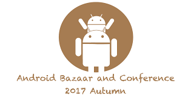

### こんなカンファレンス行きました
　　　　　　　　　　　　　〜2017/10〜
 

 
 
　　　　　　　　　　　　Naoki Takimoto
---
今回行ったカンファレンス
 

* DevFest Tokyo 2017
* Android Bazaar and Conference 2017 Autumn （ABC 2017 Autumn）

---
### DevFest Tokyo 2017

---
DevFest Tokyo 2017
 

日時：2017/10/9(月) 10:00〜17:00 
場所：東京国際交流館 
主催：[東京で活躍している 14 のコミュニティ](https://tokyo.gdgjapan.org/team) 
人数：約1,000人 
内容：[タイムテーブル](https://tokyo.gdgjapan.org/schedule/day1) 
URL：https://tokyo.gdgjapan.org/ 

---
### レポート

---
スケジュール
 

10:00 オープニング 
10:40 クラウドってなんだろ？クラウドを活かすアプリケーション設計とは？ 
11:30 大半のウェブサービス/アプリは，Firebaseなら簡単で安いですよ 
12:10 昼休憩 
13:20 ナビゲーションのUIベストプラクティス 
14:10 React Nativeアプリをリリースし続けるために、最初に行う8つの取り組み 
15:00 FirebaseAnalytics + BigQuery + DataStudio 
15:50 FlutterでAndroid/iOS両対応のアプリ開発

---
### Android Bazaar and  Conference 2017 Autumn

---
Android Bazaar and Conference 2017 Autumn
 

日時：2017/10/14(土) 10:00〜18:00 
場所：川崎市産業振興会館 
主催：日本Androidの会 
人数：約500人 
内容：[タイムテーブル](http://abc.android-group.jp/2017a/timetables/) 
　　　[バザール](http://abc.android-group.jp/2017a/bazaar/) 
URL：http://abc.android-group.jp/2017a/ 

---
### レポート

